# LegalConnect - Mermaid Diagrams

This file contains all Mermaid code for the diagrams referenced in the SRS document.

---

## 1. Context Diagram (Level 0 - System Overview)

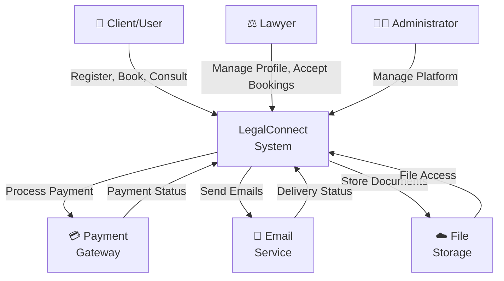

---

## 2. Data Flow Diagram (Level 1 - Main Processes)

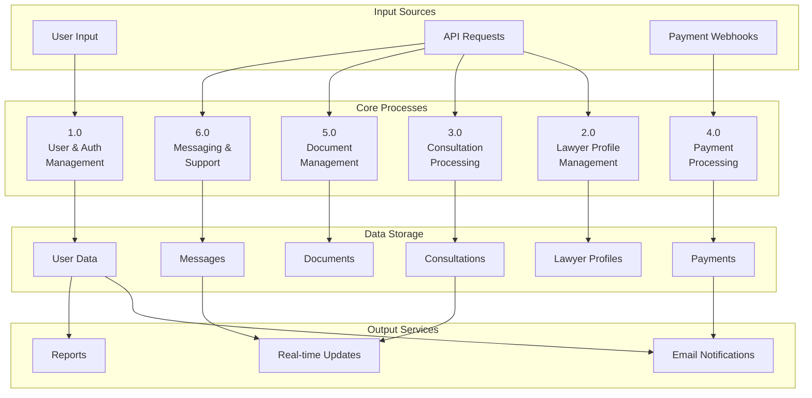

---

## 3. Entity Relationship Diagram (ERD - Database Schema)

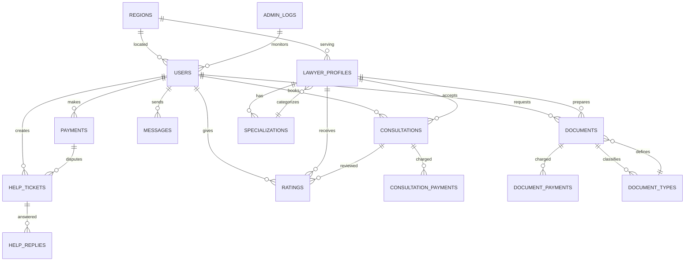

---

## 4. Use Case Diagram - All Actors and Use Cases

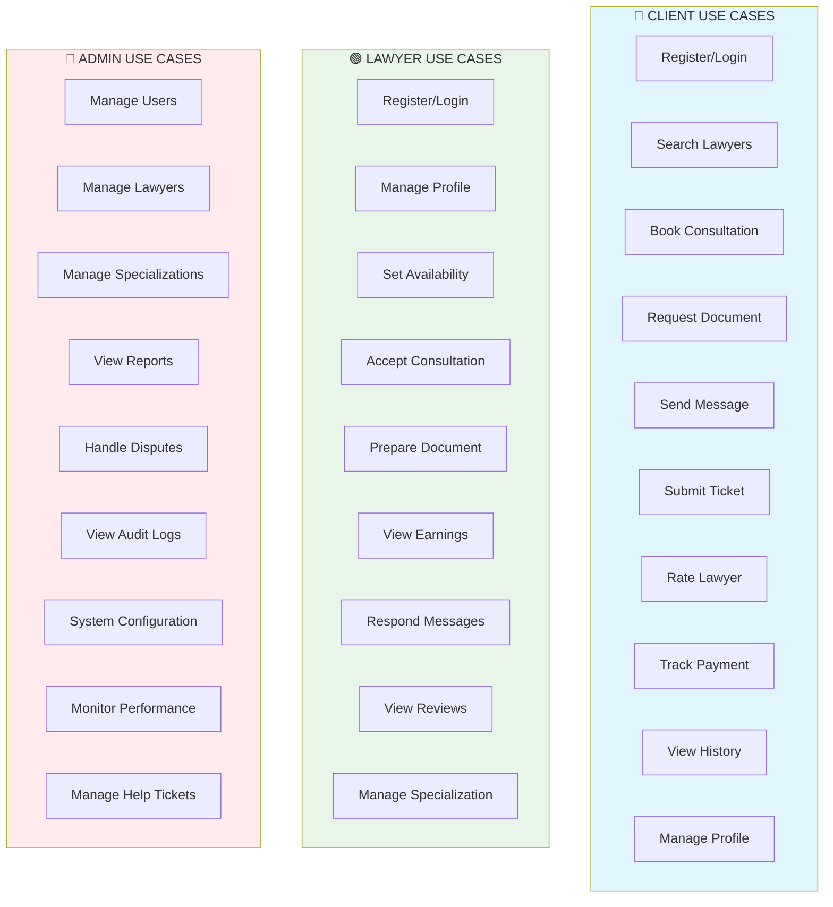

---

## 5. Sequence Diagram - Consultation Booking Flow

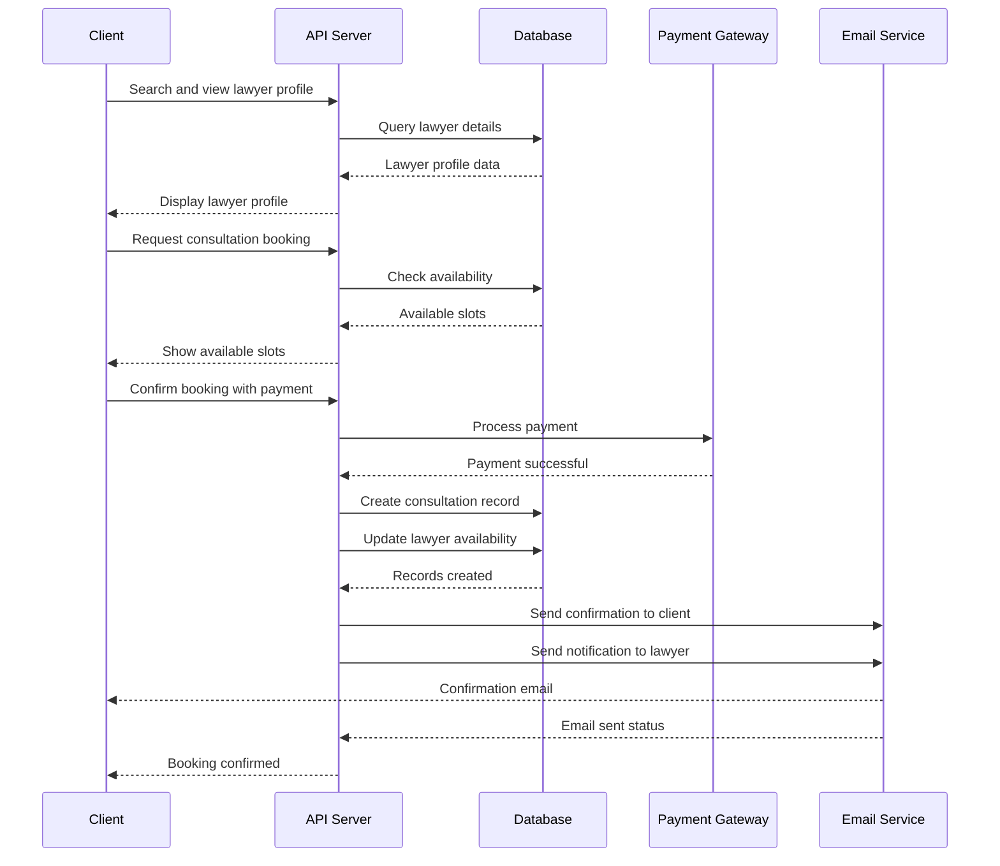

---

## 6. State Diagram - Consultation Lifecycle

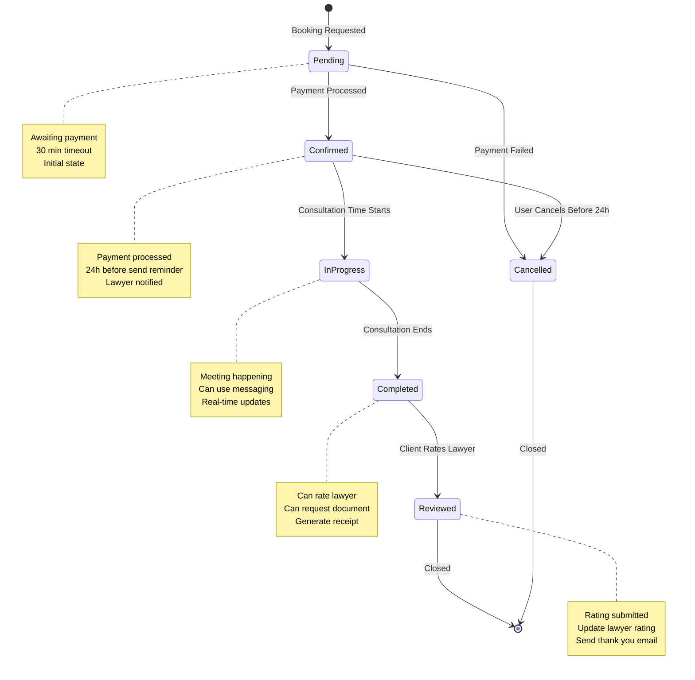

---

## 7. Deployment Architecture Diagram

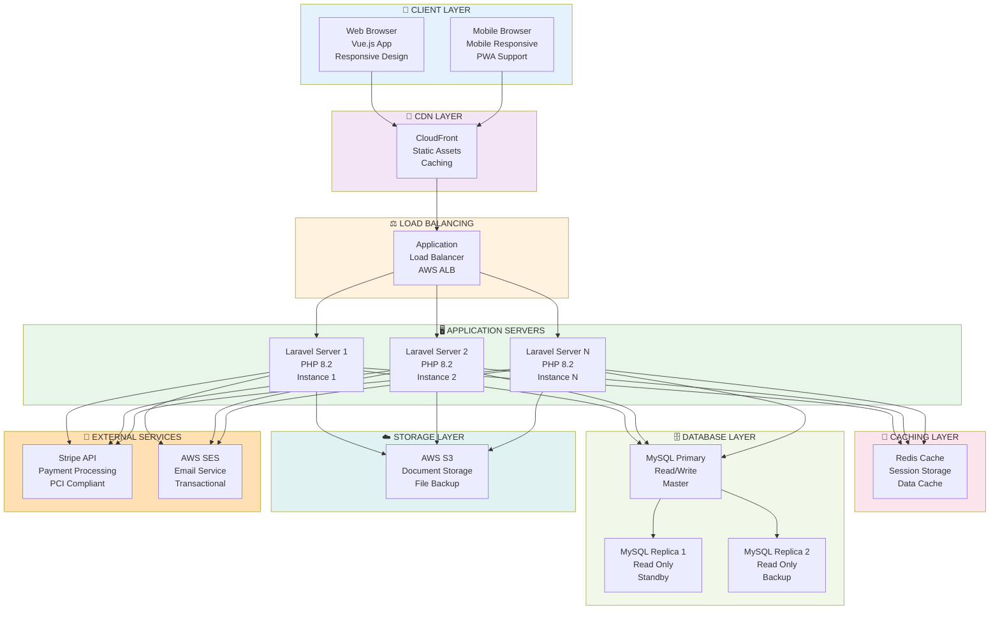

---

## 8. Document Request Process Flow

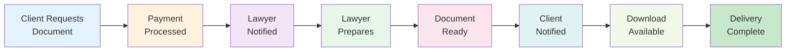

---

## 9. Help Ticket Resolution Flow

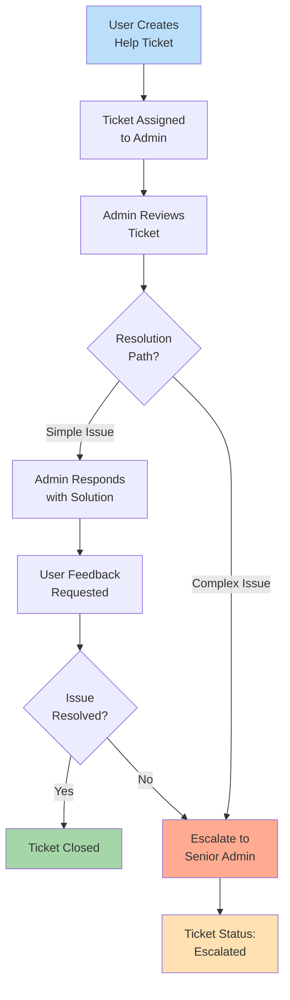

---

## 10. Authentication Flow Diagram

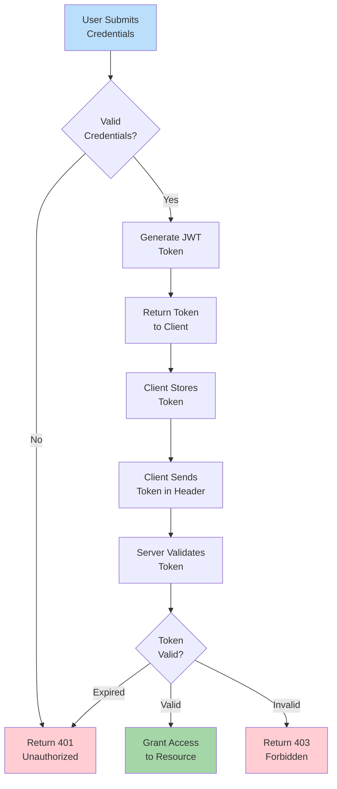

---

## 11. Real-time Messaging Architecture

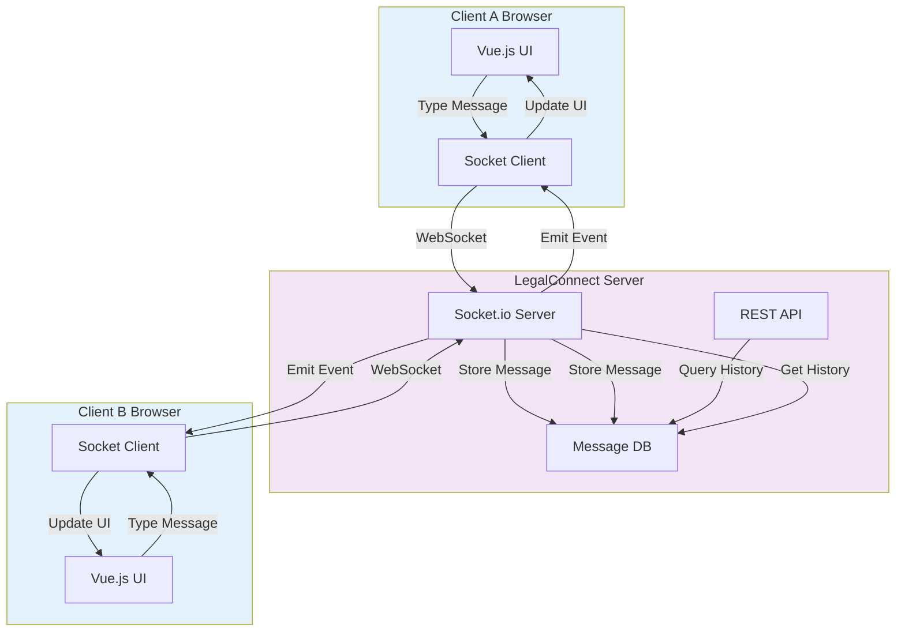

---

## 12. Payment Processing Flow

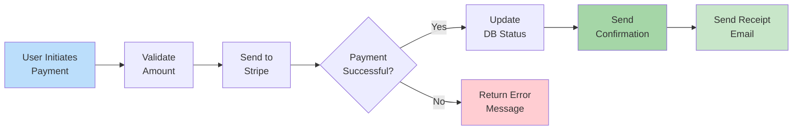

---

## 13. User Registration Flow

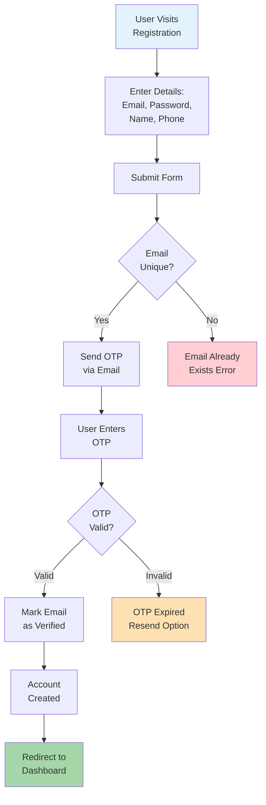

---

## 14. System Architecture Overview

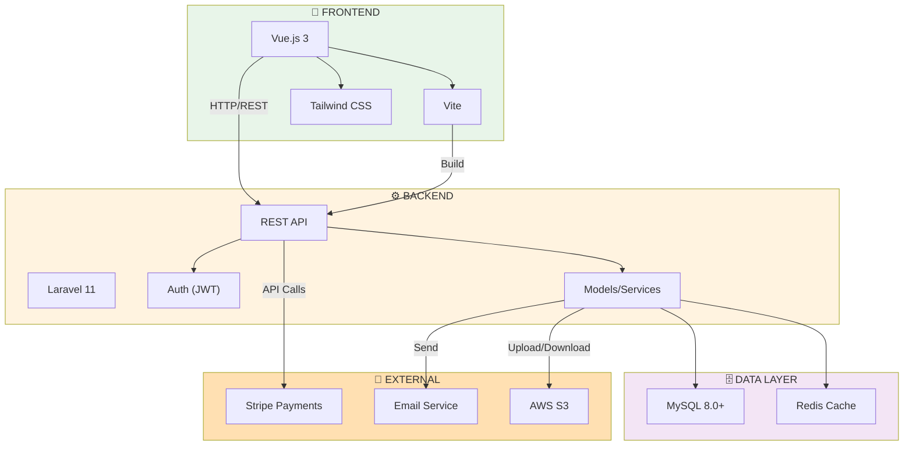

---

## 15. Lawyer Availability Management

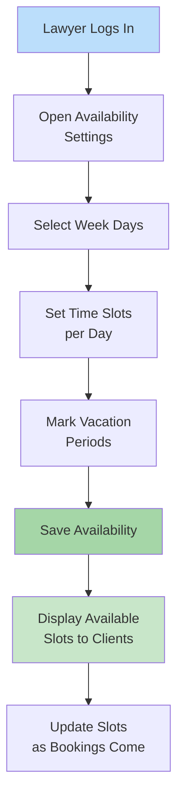

---

You can copy these Mermaid diagrams directly into:
- Mermaid Live Editor: https://mermaid.live
- GitHub Markdown files
- VS Code with Mermaid extension
- Confluence, Notion, or other documentation platforms

All diagrams are production-ready and can be customized with colors and styling as needed.
