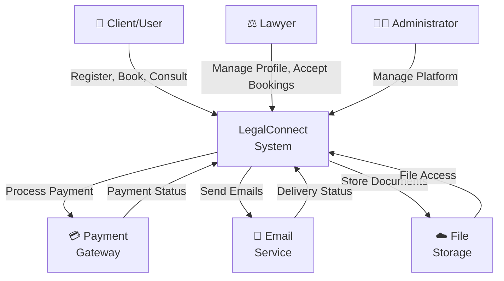
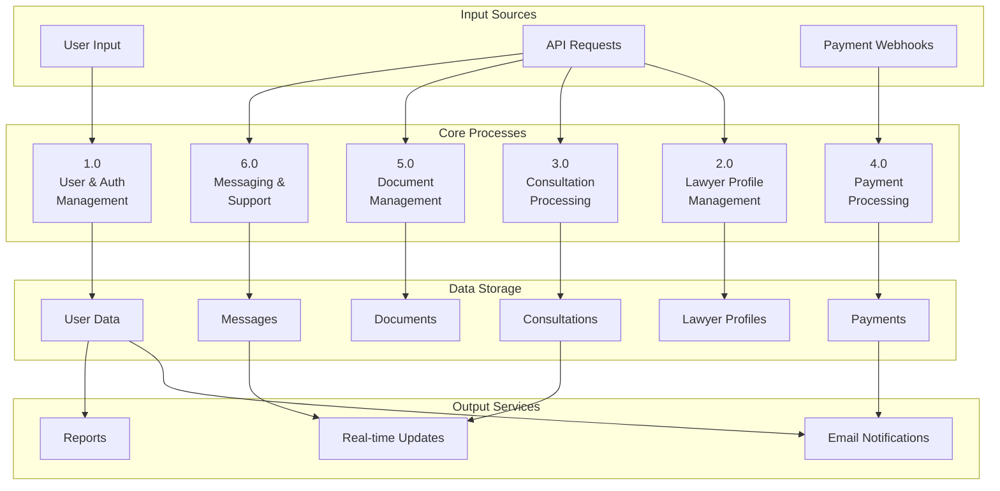
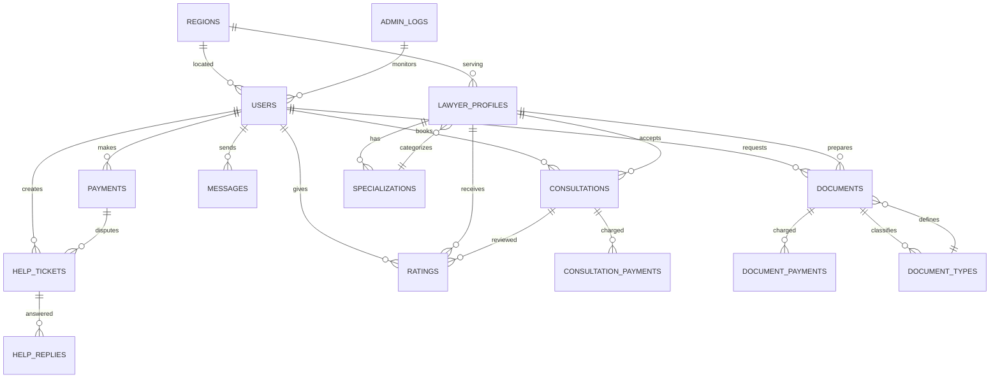
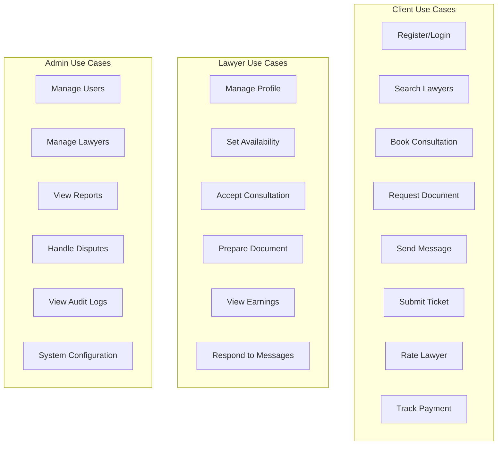
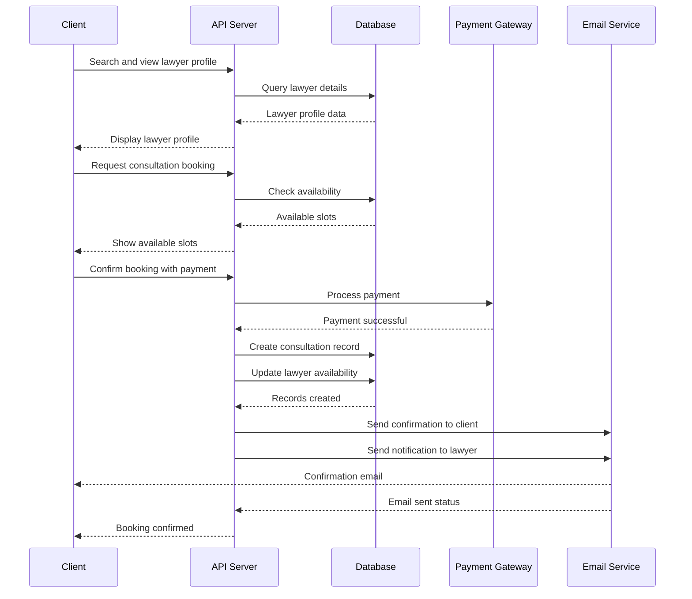
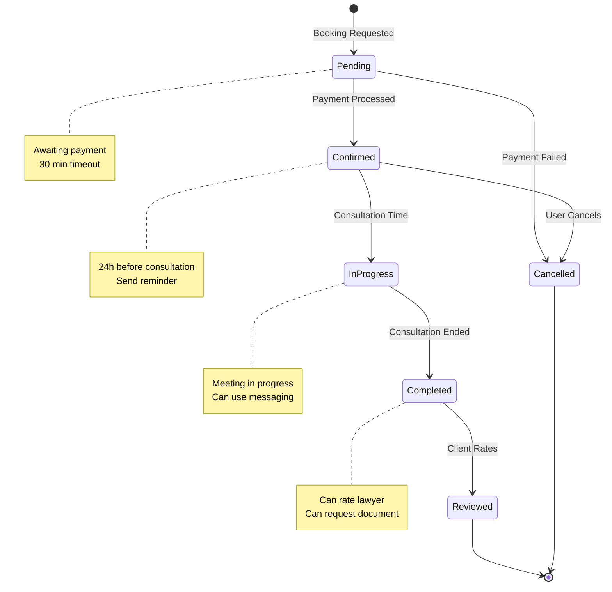
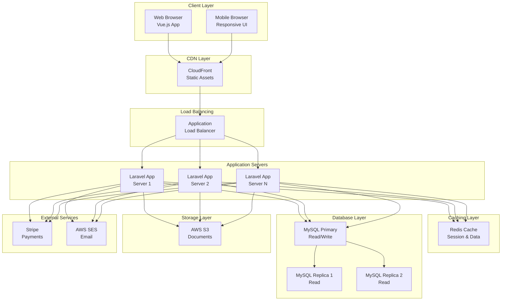

# SOFTWARE REQUIREMENTS SPECIFICATION

## LegalConnect - Legal Services Platform

**Course Code:** INT221  
**Course Name:** MVC Programming

**Student Name:** Jayan  
**Student Registration Number:** 12317185

**Client/Organization:** Lexora

**Prepared for:** Continuous Assessment 3  
**Spring 2025**

---

## TABLE OF CONTENTS

1. [REVISION HISTORY](#revision-history)
2. [INTRODUCTION](#introduction)
3. [GENERAL DESCRIPTION](#general-description)
4. [SPECIFIC REQUIREMENTS](#specific-requirements)
5. [ANALYSIS MODELS](#analysis-models)
6. [APPENDICES](#appendices)

---

## REVISION HISTORY

| Version | Date | Author | Description |
|---------|------|--------|-------------|
| 1.0 | May 18, 2026 | Jayan | Initial SRS Document |

---

## 1. INTRODUCTION

### 1.1 Purpose

This Software Requirements Specification (SRS) document describes the functional and non-functional requirements for the **LegalConnect** platform. LegalConnect is a comprehensive web-based application designed to bridge the gap between legal professionals and clients seeking legal services. This document is intended for software engineers, project managers, QA teams, and stakeholders involved in the development and deployment of the LegalConnect platform.

### 1.2 Scope

**LegalConnect** is a multi-user legal services platform that will:

- **Enable clients** to discover, consult with, and book appointments with qualified lawyers
- **Allow lawyers** to manage their profiles, specializations, availability, and consultations
- **Facilitate document request management** for legal document preparation and tracking
- **Support secure payment processing** for consultations and document services
- **Provide real-time messaging** between clients and lawyers
- **Offer help/support ticket system** for customer support
- **Enable ratings and reviews** for service quality assurance
- **Provide administrative dashboard** for platform management and monitoring
- **Support multi-region deployment** with region-based lawyer filtering

The platform will NOT:
- Handle jurisdiction-specific legal interpretations
- Provide direct legal advice through automated systems
- Store sensitive client data beyond session requirements
- Support direct billing integration without secure payment gateways

### 1.3 Definitions, Acronyms, and Abbreviations

| Term | Definition |
|------|-----------|
| **SRS** | Software Requirements Specification |
| **API** | Application Programming Interface |
| **JWT** | JSON Web Token (Authentication) |
| **OTP** | One-Time Password |
| **PDF** | Portable Document Format |
| **DFD** | Data Flow Diagram |
| **REST** | Representational State Transfer |
| **CORS** | Cross-Origin Resource Sharing |
| **MVC** | Model-View-Controller |
| **MTBF** | Mean Time Between Failures |
| **UI** | User Interface |

### 1.4 References

- IEEE Std 830-1998: IEEE Guide to Software Requirements Specifications
- Laravel 11 Documentation: https://laravel.com/docs
- Vue.js 3 Documentation: https://vuejs.org/
- RESTful API Design Guidelines: https://restfulapi.net/
- OWASP Top 10 Security Standards: https://owasp.org/
- Payment Gateway Integration Standards: PCI DSS Compliance

### 1.5 Overview

This SRS document is organized into the following major sections:

- **Section 2 (General Description):** Provides context about the product, its perspective, functions, user characteristics, and constraints
- **Section 3 (Specific Requirements):** Details all functional and non-functional requirements with measurable criteria
- **Section 4 (Analysis Models):** Includes Data Flow Diagrams, Use Case diagrams, and Entity Relationship diagrams
- **Appendices:** Contains supplementary information and detailed models

---

## 2. GENERAL DESCRIPTION

### 2.1 Product Perspective

LegalConnect is a standalone web-based application that operates as an independent platform. It integrates with:

- **Payment Gateways:** Stripe/PayPal for secure transaction processing
- **Email Services:** SMTP for notification delivery and OTP generation
- **Authentication Services:** JWT-based authentication with OAuth2 support
- **PDF Generation:** DomPDF library for document creation and export
- **External APIs:** Integration capabilities for third-party legal document services (future scope)

The platform follows the MVC (Model-View-Controller) architecture with:
- **Backend:** Laravel 11 PHP framework
- **Frontend:** Vue.js 3 with Vite build tool and Tailwind CSS
- **Database:** Relational database system (MySQL/PostgreSQL)
- **Storage:** Cloud-based file storage for documents

### 2.2 Product Functions

The LegalConnect platform provides the following major functions:

1. **User Management**
   - User registration and authentication
   - Profile management (personal and professional)
   - Account settings and preferences
   - Notification preference management

2. **Lawyer Management**
   - Lawyer profile creation and management
   - Specialization management
   - Availability scheduling
   - Rating and review management

3. **Consultation Services**
   - Consultation booking and scheduling
   - Consultation payment processing
   - Consultation confirmation and reminders
   - Consultation history tracking

4. **Document Services**
   - Document type definition and management
   - Document request submission
   - Document preparation and delivery
   - Document payment processing

5. **Communication**
   - Real-time messaging between clients and lawyers
   - Help ticket creation and management
   - Ticket resolution tracking
   - Email notifications

6. **Support System**
   - Help ticket submission
   - Ticket status tracking
   - Admin replies to tickets
   - Resolution confirmation

7. **Administrative Functions**
   - User and lawyer account management
   - Platform monitoring and statistics
   - Help ticket management
   - Activity logging and audit trails

### 2.3 User Characteristics

The platform serves the following user categories:

**Primary Users:**
- **Clients:** Individuals seeking legal services, basic computer literacy, varying technical proficiency
- **Lawyers:** Legal professionals with professional email, intermediate technical proficiency
- **Administrators:** Platform managers with technical expertise and administrative responsibilities

**User Characteristics:**
- Clients: Age 18+, varying education levels, seeking convenient access to legal services
- Lawyers: Qualified legal professionals, professional credentials, seeking to expand client base
- Admins: Technical personnel, system administration experience, security-conscious

### 2.4 General Constraints

The following constraints apply to the development and deployment of LegalConnect:

- **Technology Stack:** Must use Laravel 11, Vue.js 3, and MySQL/PostgreSQL
- **Browser Compatibility:** Support for Chrome, Firefox, Safari, Edge (latest 2 versions)
- **Hosting Environment:** Linux-based server with PHP 8.2+
- **Response Time:** Must support concurrent users up to 5,000 with minimal latency
- **Data Retention:** Compliance with GDPR and local data protection regulations
- **Payment Processing:** Must comply with PCI DSS standards
- **Budget:** Development costs limited to agreed-upon budget
- **Timeline:** Project delivery within Spring 2025 semester

### 2.5 Assumptions and Dependencies

**Assumptions:**
- Users will have reliable internet connectivity
- Lawyers will have valid professional credentials
- Payment gateway services will remain available
- Email delivery services will function properly
- Database will have adequate storage and backup
- Users will follow acceptable use policies

**Dependencies:**
- Laravel framework updates and compatibility
- Third-party payment gateway availability (Stripe/PayPal)
- Email service provider reliability
- Browser security standards and updates
- Operating system and server maintenance
- Internet bandwidth and CDN services

---

## 3. SPECIFIC REQUIREMENTS

### 3.1 External Interface Requirements

#### 3.1.1 User Interfaces

**Client Web Interface:**
- Responsive design supporting desktop (1920x1080 minimum) and tablet (768x1024)
- Navigation menu with dashboard, lawyer discovery, bookings, messages, tickets, and profile sections
- Search and filter functionality for lawyer discovery
- Consultation booking calendar interface
- Document request submission forms
- Messaging interface with real-time notifications
- Help ticket creation and tracking interface

**Lawyer Web Interface:**
- Dashboard with consultation requests and pending documents
- Profile management interface
- Availability calendar management
- Consultation history and earnings tracking
- Message inbox and response interface
- Performance metrics and ratings display

**Administrator Interface:**
- Dashboard with platform statistics
- User and lawyer management panel
- Help ticket management system
- Activity audit logs
- System configuration and settings panel

#### 3.1.2 Hardware Interfaces

- **Server Hardware:** Minimum 2 CPU cores, 4GB RAM, 100GB SSD storage
- **Client Hardware:** Standard laptops, desktops, and tablets with modern processors
- **Network:** 100Mbps minimum internet connectivity
- **Storage:** Cloud-based storage with automatic backup (daily increments)

#### 3.1.3 Software Interfaces

**Backend APIs:**
- RESTful API endpoints for all CRUD operations
- JSON request/response format
- HTTP status codes (200, 201, 400, 401, 403, 404, 500)
- JWT token-based authentication
- Rate limiting (100 requests/minute per IP)

**Database Interfaces:**
- MySQL 8.0+ or PostgreSQL 12+
- Prepared statements for SQL injection prevention
- Transactions for data consistency
- Indexing for performance optimization

**External Service Integrations:**
- Payment Gateway: Stripe/PayPal API (v1.0)
- Email Service: SMTP with TLS encryption
- File Storage: AWS S3 or equivalent cloud storage
- PDF Generation: DomPDF library

#### 3.1.4 Communications Interfaces

- **HTTP/HTTPS:** All communications must use TLS 1.2+
- **WebSocket:** Real-time messaging using Socket.io
- **Email:** SMTP for transactional and notification emails
- **REST API:** For all client-server communications
- **API Authentication:** Bearer token (JWT) in Authorization header

### 3.2 Functional Requirements

#### 3.2.1 User Authentication and Management

**Requirement FR-001: User Registration**

**Introduction:** The system must allow new users (clients and lawyers) to register accounts with minimal steps while ensuring data validation and security.

**Inputs:**
- Email address (unique, valid format)
- Password (minimum 8 characters, mixed case, numbers, special characters)
- Full name (alphabetic characters)
- Phone number (valid format)
- User type (client or lawyer)
- Specialization (for lawyers only)
- Region (from predefined list)

**Processing:**
- Validate all input fields
- Check email uniqueness in database
- Hash password using bcrypt algorithm
- Generate OTP and send via email
- Store user record in database with 'email_verified' = false

**Outputs:**
- Confirmation message
- OTP verification page
- Email with OTP

**Error Handling:**
- Email already exists: Return 409 Conflict
- Invalid email format: Return 400 Bad Request
- Weak password: Return 400 with specific requirements
- Email delivery failure: Retry up to 3 times, then queue for later

**Requirement FR-002: Email Verification**

**Introduction:** Users must verify their email address before accessing the platform.

**Inputs:**
- Email address
- OTP (6-digit code)

**Processing:**
- Retrieve user by email
- Compare OTP with stored value
- Check OTP expiration (15 minutes)
- Update 'email_verified' to true
- Delete OTP record

**Outputs:**
- Verification success message
- Redirect to login page

**Error Handling:**
- Invalid OTP: Return 400
- OTP expired: Provide option to resend
- User not found: Return 404

**Requirement FR-003: User Login**

**Introduction:** Users must authenticate with email and password to access their accounts.

**Inputs:**
- Email address
- Password

**Processing:**
- Query database for user by email
- Verify password using bcrypt comparison
- Check email verification status
- Check account suspension status
- Generate JWT token (validity: 24 hours)
- Log login activity

**Outputs:**
- JWT token
- User profile information
- Dashboard redirect

**Error Handling:**
- Invalid credentials: Return 401 Unauthorized
- Email not verified: Return 403 with verification reminder
- Account suspended: Return 403 with reason
- Maximum login attempts exceeded: Temporary lockout for 30 minutes

**Requirement FR-004: Password Reset**

**Introduction:** Users can reset forgotten passwords securely.

**Inputs:**
- Email address

**Processing:**
- Generate secure reset token (valid for 1 hour)
- Send reset link via email
- Store token in database with expiration

**Outputs:**
- Email with reset link
- Password reset form

**Error Handling:**
- Email not found: Return 404
- Multiple reset requests: Limit to 5 per hour
- Token expired: Request new reset

#### 3.2.2 Lawyer Profile Management

**Requirement FR-005: Create/Update Lawyer Profile**

**Introduction:** Lawyers can create and manage their professional profiles to showcase qualifications.

**Inputs:**
- License number (unique)
- Specializations (multiple selection)
- Experience years (numeric)
- Education details
- Profile photo (max 5MB, JPG/PNG)
- Bio/description (max 500 characters)
- Languages spoken (multiple selection)
- Hourly rate (decimal, USD)
- Region (from predefined list)

**Processing:**
- Validate license number format
- Upload and compress photo
- Store profile data
- Create/update specialization relationships
- Index for search functionality

**Outputs:**
- Profile success message
- Profile preview
- Search visibility confirmation

**Error Handling:**
- Duplicate license: Return 409
- Invalid file format: Return 400
- File too large: Return 413
- Invalid rate: Return 400

**Requirement FR-006: Manage Availability**

**Introduction:** Lawyers can set their working hours and availability for consultations.

**Inputs:**
- Day of week
- Start time
- End time
- Recurring/one-time
- Vacation periods

**Processing:**
- Validate time ranges
- Store availability slots
- Make unavailable slots during vacation
- Calculate available consultation slots

**Outputs:**
- Availability calendar updated
- Confirmation message

**Error Handling:**
- Invalid time range: Return 400
- Overlapping slots: Return 409
- Past dates: Return 400

#### 3.2.3 Consultation Management

**Requirement FR-007: Search and Discover Lawyers**

**Introduction:** Clients can search for lawyers based on various criteria.

**Inputs:**
- Specialization (filter)
- Region (filter)
- Rating (filter: minimum)
- Availability (filter: date/time)
- Keyword (search)

**Processing:**
- Query database with multiple filters
- Apply sorting (rating, experience, availability)
- Paginate results (10 per page)
- Include lawyer profile summary

**Outputs:**
- List of matching lawyers
- Pagination controls
- Detailed lawyer cards

**Error Handling:**
- No results: Return empty list with suggestion
- Invalid filters: Return 400
- Database query error: Return 500

**Requirement FR-008: Book Consultation**

**Introduction:** Clients can book consultations with lawyers.

**Inputs:**
- Lawyer ID
- Preferred date
- Preferred time slot
- Consultation type (online/offline)
- Issue description
- Payment method

**Processing:**
- Verify lawyer availability
- Check conflicts in schedule
- Create consultation record
- Process payment (with retry logic)
- Send confirmation emails to both parties
- Create reminder tasks (24 hours before)

**Outputs:**
- Booking confirmation
- Consultation details
- Payment receipt
- Calendar invite email

**Error Handling:**
- Lawyer unavailable: Return 409
- Payment failed: Return 402 with retry option
- Date in past: Return 400
- Invalid consultation type: Return 400

**Requirement FR-009: Manage Consultation Status**

**Introduction:** Track consultation status from booking to completion.

**Inputs:**
- Consultation ID
- Status update (scheduled/in-progress/completed/cancelled)
- Cancellation reason (if applicable)

**Processing:**
- Update consultation status
- Log status change with timestamp
- Send notification emails
- Calculate refund if cancelled (based on time)
- Trigger payment if status is completed

**Outputs:**
- Status update confirmation
- Notification emails
- Refund confirmation (if applicable)

**Error Handling:**
- Invalid status transition: Return 400
- Unauthorized status change: Return 403
- Consultation not found: Return 404

#### 3.2.4 Document Request Management

**Requirement FR-010: Request Document**

**Introduction:** Clients can request legal documents from lawyers.

**Inputs:**
- Document type (from predefined list)
- Required date
- Additional requirements/notes
- Payment method
- Priority level (normal/urgent)

**Processing:**
- Create document request record
- Assign to lawyer or queue
- Process payment
- Send notification to lawyer
- Create reminder for deadline

**Outputs:**
- Request confirmation
- Request tracking ID
- Payment receipt
- Timeline estimate

**Error Handling:**
- Invalid document type: Return 400
- Payment failure: Return 402
- No available lawyer: Return 503

**Requirement FR-011: Manage Document Status**

**Introduction:** Track document request status and delivery.

**Inputs:**
- Document request ID
- Status update (requested/in-progress/ready/delivered)
- Document file (if status = ready)

**Processing:**
- Update request status
- Upload document file
- Send notification to client
- Create download link with expiration
- Log document delivery

**Outputs:**
- Status update confirmation
- Download link (if ready)
- Email notification
- Delivery receipt

**Error Handling:**
- Invalid file format: Return 400
- File too large: Return 413
- Request not found: Return 404

#### 3.2.5 Payment Processing

**Requirement FR-012: Process Payment**

**Introduction:** Handle secure payment processing for consultations and documents.

**Inputs:**
- Payment amount (decimal, USD)
- Payment method (credit card/debit card)
- Card details (PCI compliance)
- Client information
- Transaction type (consultation/document)

**Processing:**
- Validate payment amount
- Send request to payment gateway (Stripe/PayPal)
- Handle payment response
- Store transaction record
- Generate receipt
- Update related consultation/document record
- Send payment confirmation email

**Outputs:**
- Transaction ID
- Receipt
- Confirmation email
- Payment status update

**Error Handling:**
- Invalid card: Return 402 with gateway error
- Insufficient funds: Return 402
- Expired card: Return 402
- Gateway timeout: Retry up to 3 times
- Duplicate transaction: Check and prevent within 10 seconds

**Requirement FR-013: Refund Processing**

**Introduction:** Handle refunds for cancelled consultations or returns.

**Inputs:**
- Transaction ID
- Refund reason
- Refund amount (full or partial)

**Processing:**
- Validate original transaction
- Calculate refund eligibility
- Send refund request to payment gateway
- Update transaction record
- Create refund record
- Send refund confirmation email

**Outputs:**
- Refund confirmation
- Refund amount
- Expected timeframe
- Confirmation email

**Error Handling:**
- Transaction not found: Return 404
- Invalid refund amount: Return 400
- Gateway error: Retry and queue for manual processing
- Refund window expired: Return 400 with policy explanation

#### 3.2.6 Real-Time Messaging

**Requirement FR-014: Send Message**

**Introduction:** Enable real-time messaging between clients and lawyers.

**Inputs:**
- Recipient ID
- Message content (max 5000 characters)
- Attachments (optional, max 10MB)

**Processing:**
- Validate message content
- Upload attachments if present
- Store message in database
- Emit real-time event via WebSocket
- Create notification for recipient
- Log message for audit

**Outputs:**
- Message sent confirmation
- Message timestamp
- Read status update

**Error Handling:**
- Recipient not found: Return 404
- Message too long: Return 400
- File too large: Return 413
- Unauthorized sender: Return 403

**Requirement FR-015: Retrieve Message History**

**Introduction:** Fetch conversation history between two users.

**Inputs:**
- Other user ID
- Pagination limit (default: 20)
- Date range (optional)

**Processing:**
- Query messages between users
- Apply sorting (oldest to newest)
- Mark messages as read
- Paginate results
- Include attachments metadata

**Outputs:**
- Conversation history
- Pagination info
- Attachment download links

**Error Handling:**
- Unauthorized access: Return 403
- User not found: Return 404
- Invalid pagination: Return 400

#### 3.2.7 Help Ticket System

**Requirement FR-016: Create Help Ticket**

**Introduction:** Users can submit support requests through the help ticket system.

**Inputs:**
- Subject (max 100 characters)
- Description (max 5000 characters)
- Category (dropdown: billing, technical, consultation, document, other)
- Priority (low/medium/high)
- Attachments (optional)

**Processing:**
- Validate input fields
- Create ticket record
- Generate unique ticket ID
- Assign ticket number
- Send confirmation email
- Create reminder task for admin

**Outputs:**
- Ticket creation confirmation
- Ticket ID
- Expected response time
- Confirmation email

**Error Handling:**
- Missing required fields: Return 400
- File too large: Return 413
- File invalid format: Return 400

**Requirement FR-017: Respond to Help Ticket**

**Introduction:** Admins can respond to user support tickets.

**Inputs:**
- Ticket ID
- Response message (max 5000 characters)
- Attachments (optional)

**Processing:**
- Verify admin authorization
- Update ticket status
- Store response message
- Send notification to user
- Log admin action

**Outputs:**
- Response stored confirmation
- User notification email
- Ticket status update

**Error Handling:**
- Ticket not found: Return 404
- Unauthorized: Return 403
- Ticket closed: Return 409

**Requirement FR-018: Close Help Ticket**

**Introduction:** Users or admins can close support tickets when issue is resolved.

**Inputs:**
- Ticket ID
- Resolution status (resolved/unresolved/escalated)
- Feedback rating (1-5 stars)
- Comments (optional)

**Processing:**
- Verify authorization
- Update ticket status to closed
- Record resolution type
- Store feedback
- Send closure confirmation email

**Outputs:**
- Closure confirmation
- Ticket reference for future
- Confirmation email

**Error Handling:**
- Ticket not found: Return 404
- Already closed: Return 409
- Unauthorized: Return 403

#### 3.2.8 Ratings and Reviews

**Requirement FR-019: Submit Rating/Review**

**Introduction:** Clients can rate and review lawyers after consultation.

**Inputs:**
- Lawyer ID
- Consultation ID
- Rating (1-5 stars)
- Review text (max 500 characters)
- Recommend flag (yes/no)

**Processing:**
- Verify consultation completion
- Validate rating range
- Store review and rating
- Update lawyer average rating
- Update lawyer recommendation percentage
- Index for search

**Outputs:**
- Rating submission confirmation
- Updated lawyer profile
- Public review (after moderation if needed)

**Error Handling:**
- Consultation not found: Return 404
- Already reviewed: Return 409
- Invalid rating: Return 400
- Unauthorized: Return 403

**Requirement FR-020: View Ratings/Reviews**

**Introduction:** Display lawyer ratings and reviews.

**Inputs:**
- Lawyer ID
- Filter (all/recent/high-rated)
- Pagination

**Processing:**
- Query reviews for lawyer
- Calculate average rating
- Sort by selected filter
- Paginate results
- Calculate recommendation percentage

**Outputs:**
- Reviews list
- Average rating
- Total review count
- Recommendation percentage

**Error Handling:**
- Lawyer not found: Return 404
- Invalid filter: Return 400

#### 3.2.9 Administrative Functions

**Requirement FR-021: User Account Management**

**Introduction:** Admins can manage user accounts and access.

**Inputs:**
- User ID
- Action (suspend/activate/delete/verify)
- Reason (if suspension)
- Duration (if temporary)

**Processing:**
- Verify admin authorization
- Update user status
- Log admin action
- Send notification email to user
- Cascade effect for related records

**Outputs:**
- Status update confirmation
- Audit log entry
- User notification

**Error Handling:**
- User not found: Return 404
- Invalid action: Return 400
- Unauthorized: Return 403
- Self-modification restrictions: Return 403

**Requirement FR-022: View Activity Logs**

**Introduction:** Admins can view system activity logs for audit purposes.

**Inputs:**
- Filter: User ID, action type, date range
- Pagination

**Processing:**
- Query admin log records
- Apply filters
- Sort by timestamp (newest first)
- Paginate results
- Format for display

**Outputs:**
- Activity logs list
- Filter applied
- Pagination info

**Error Handling:**
- Unauthorized: Return 403
- Invalid date range: Return 400
- No logs found: Return empty list

### 3.5 Non-Functional Requirements

#### 3.5.1 Performance

**Requirement NFR-001: Response Time**
- Page load time: < 3 seconds for initial load, < 1 second for subsequent requests
- API response time: < 500ms for 95% of requests
- Database query time: < 200ms for standard queries
- Real-time messaging delivery: < 100ms latency

**Requirement NFR-002: Throughput**
- Support minimum 5,000 concurrent users
- Process 1,000 API requests per second
- Handle 500 simultaneous WebSocket connections
- Process 100 payment transactions per minute

**Requirement NFR-003: Scalability**
- Horizontal scaling capability with load balancing
- Database sharding support for large datasets
- Caching strategy (Redis) for frequently accessed data
- CDN integration for static assets

#### 3.5.2 Reliability

**Requirement NFR-004: System Availability**
- Target uptime: 99.5% (maximum 3.6 hours downtime per month)
- Planned maintenance downtime: Scheduled during off-peak hours with 24-hour notice
- Automatic failover mechanisms for critical services
- Recovery time objective (RTO): < 15 minutes for critical failures

**Requirement NFR-005: Data Integrity**
- ACID compliance for all database transactions
- Automatic backup every 24 hours with 30-day retention
- Backup verification and recovery testing monthly
- Data consistency checks on critical updates
- Transaction rollback capability for failed operations

**Requirement NFR-006: Mean Time Between Failures (MTBF)**
- Target MTBF: > 30 days without critical service interruption
- Error logging and monitoring for all failures
- Automatic alerts for admin team
- Root cause analysis and documentation

#### 3.5.3 Availability

**Requirement NFR-007: Access Availability**
- 24/7 platform availability except during maintenance windows
- Geographic redundancy for critical services
- Database replication across multiple data centers
- Load balancing for even distribution

**Requirement NFR-008: Maintenance Windows**
- Monthly maintenance: 2-4 hours, typically 2-4 AM on first Sunday
- Notice period: Minimum 7 days for major updates
- User notification: Email and in-app banner notifications

#### 3.5.4 Security

**Requirement NFR-009: Authentication and Authorization**
- JWT-based authentication with 24-hour token expiration
- Multi-factor authentication (MFA) support for future implementation
- Role-based access control (RBAC): Client, Lawyer, Admin
- Session management with automatic logout after 30 minutes of inactivity
- Secure password hashing using bcrypt with salt

**Requirement NFR-010: Data Protection**
- All data transmission over HTTPS/TLS 1.2+
- Encryption at rest for sensitive data (passwords, payment info)
- PCI DSS compliance for payment card data
- GDPR compliance for user data handling
- Data anonymization for deleted user records

**Requirement NFR-011: SQL Injection Prevention**
- Use parameterized queries/prepared statements for all database operations
- Input validation on all user inputs
- Output encoding for XSS prevention
- Regular security code reviews

**Requirement NFR-012: API Security**
- Rate limiting: 100 requests/minute per IP
- CORS policy: Whitelist allowed domains
- API authentication: Bearer token required
- Request signature validation for sensitive operations
- DDoS protection mechanisms

**Requirement NFR-013: Payment Security**
- PCI DSS Level 1 compliance
- No direct storage of credit card numbers
- Payment token usage for recurring transactions
- SSL/TLS encryption for payment data
- Fraud detection and prevention

**Requirement NFR-014: Access Control**
- Principle of least privilege
- Admin-only access to admin dashboard
- User can only access own data
- Lawyer can only modify own profile and consultations
- Audit logging for administrative actions

#### 3.5.5 Maintainability

**Requirement NFR-015: Code Quality**
- Follow PSR-12 PHP coding standards
- Code documentation and comments for complex logic
- Unit test coverage: minimum 80%
- Code reviews before merging to main branch
- Static code analysis tools (Psalm, PHPStan)

**Requirement NFR-016: System Monitoring**
- Real-time monitoring of system health
- Error and exception logging to centralized log server
- Performance metrics tracking (CPU, memory, disk)
- Automated alerts for critical issues
- Dashboard for operations team

**Requirement NFR-017: Update and Patch Management**
- Regular security patches (within 1 week of release)
- Framework updates quarterly or as needed
- Dependency updates with compatibility testing
- Changelog documentation for all updates

#### 3.5.6 Portability

**Requirement NFR-018: Browser Compatibility**
- Chrome (latest 2 versions)
- Firefox (latest 2 versions)
- Safari (latest 2 versions)
- Edge (latest 2 versions)
- Mobile browsers: iOS Safari, Chrome Android

**Requirement NFR-019: Operating System Support**
- Linux (Ubuntu 20.04 LTS+, Debian 11+)
- macOS (for development)
- Docker containerization support
- Environment-based configuration (development, staging, production)

**Requirement NFR-020: Database Portability**
- Support for MySQL 8.0+ and PostgreSQL 12+
- Database agnostic ORM (Eloquent)
- Migration scripts for version upgrades
- Backup/restore compatibility across versions

**Requirement NFR-021: Cloud Deployment**
- AWS support (EC2, RDS, S3, CloudFront)
- Docker and Kubernetes compatibility
- Environment variable configuration
- Infrastructure as Code support

### 3.7 Design Constraints

**DC-001: Technology Stack**
- Backend: Laravel 11 PHP framework
- Frontend: Vue.js 3 with Vite
- Database: MySQL 8.0+ or PostgreSQL 12+
- Styling: Tailwind CSS
- Real-time: Socket.io for WebSocket communication

**DC-002: Architectural Constraints**
- MVC (Model-View-Controller) architecture
- RESTful API design for backend
- Component-based frontend architecture
- Service-oriented backend with dependency injection

**DC-003: Database Schema**
- Normalized relational schema (3NF minimum)
- Foreign key constraints for referential integrity
- Indexing on frequently queried columns
- Partitioning support for large tables

**DC-004: Third-Party Dependencies**
- Must use established and maintained libraries
- Dependency version pinning for stability
- Security vulnerability monitoring
- License compatibility (Apache 2.0, MIT, GPL compatible)

**DC-005: Development Environment**
- Version control: Git with GitHub
- CI/CD pipeline: GitHub Actions or similar
- Package managers: Composer (PHP), npm/yarn (JavaScript)
- Development tools: VS Code, Docker for local development

### 3.9 Other Requirements

**Requirement OR-001: Localization**
- Support for English language initially
- Extensible architecture for multi-language support
- Date and time localization
- Currency support (USD, local currencies)

**Requirement OR-002: Reporting**
- Consultation reports for clients and lawyers
- Payment and revenue reports for admins
- System activity reports
- PDF export capability for reports

**Requirement OR-003: Backup and Recovery**
- Automated daily backups
- 30-day backup retention
- Point-in-time recovery capability
- Backup verification and testing

**Requirement OR-004: Documentation**
- API documentation (Swagger/OpenAPI)
- User guides for clients and lawyers
- Administrator manual
- Developer documentation
- Troubleshooting guides

**Requirement OR-005: Compliance**
- Terms of Service agreement
- Privacy Policy
- Cookie consent management
- Data retention policies
- Dispute resolution mechanisms

---

## 4. ANALYSIS MODELS

### 4.1 Data Flow Diagrams (DFD)

#### 4.1.1 Context Diagram - Level 0

This diagram shows the overall system and its interactions with external entities.



#### 4.1.2 Process Diagram - Level 1

This diagram shows the main processes within the system.



#### 4.1.3 Entity Relationship Diagram (ERD)

This diagram shows the database schema and relationships.



#### 4.1.4 Use Case Diagram

This diagram shows all use cases and actors.



#### 4.1.5 Sequence Diagram - Consultation Booking Flow



#### 4.1.6 State Diagram - Consultation States



#### 4.1.7 Deployment Architecture



---

## 5. APPENDICES

### A.1 Glossary of Terms

| Term | Definition |
|------|-----------|
| **Consultation** | A scheduled session between a client and a lawyer for legal advice |
| **Document Request** | A request from a client to a lawyer to prepare legal documents |
| **JWT** | JSON Web Token used for stateless authentication |
| **OTP** | One-Time Password sent via email for verification |
| **Specialization** | Area of legal expertise (e.g., Corporate Law, Family Law) |
| **Rating** | Numerical score (1-5) given by a client after consultation |
| **Help Ticket** | Support request submitted by a user |
| **Transaction** | Financial exchange processed through payment gateway |
| **Region** | Geographic area for filtering lawyers and users |

### A.2 Sample Database Schema (SQL)

```sql
-- Users Table
CREATE TABLE users (
    id BIGINT PRIMARY KEY AUTO_INCREMENT,
    email VARCHAR(255) UNIQUE NOT NULL,
    password VARCHAR(255) NOT NULL,
    full_name VARCHAR(255) NOT NULL,
    phone_number VARCHAR(20),
    user_type ENUM('client', 'lawyer') NOT NULL,
    email_verified BOOLEAN DEFAULT FALSE,
    is_suspended BOOLEAN DEFAULT FALSE,
    region_id BIGINT,
    created_at TIMESTAMP DEFAULT CURRENT_TIMESTAMP,
    updated_at TIMESTAMP DEFAULT CURRENT_TIMESTAMP ON UPDATE CURRENT_TIMESTAMP,
    FOREIGN KEY (region_id) REFERENCES regions(id)
);

-- Lawyer Profiles Table
CREATE TABLE lawyer_profiles (
    id BIGINT PRIMARY KEY AUTO_INCREMENT,
    user_id BIGINT UNIQUE NOT NULL,
    license_number VARCHAR(255) UNIQUE NOT NULL,
    years_experience INT,
    bio TEXT,
    photo_url VARCHAR(255),
    hourly_rate DECIMAL(10, 2),
    average_rating DECIMAL(3, 2),
    total_reviews INT DEFAULT 0,
    created_at TIMESTAMP DEFAULT CURRENT_TIMESTAMP,
    updated_at TIMESTAMP DEFAULT CURRENT_TIMESTAMP ON UPDATE CURRENT_TIMESTAMP,
    FOREIGN KEY (user_id) REFERENCES users(id) ON DELETE CASCADE
);

-- Consultations Table
CREATE TABLE consultations (
    id BIGINT PRIMARY KEY AUTO_INCREMENT,
    client_id BIGINT NOT NULL,
    lawyer_id BIGINT NOT NULL,
    consultation_date DATETIME NOT NULL,
    consultation_type ENUM('online', 'offline') DEFAULT 'online',
    status ENUM('scheduled', 'in_progress', 'completed', 'cancelled') DEFAULT 'scheduled',
    issue_description TEXT,
    created_at TIMESTAMP DEFAULT CURRENT_TIMESTAMP,
    updated_at TIMESTAMP DEFAULT CURRENT_TIMESTAMP ON UPDATE CURRENT_TIMESTAMP,
    FOREIGN KEY (client_id) REFERENCES users(id),
    FOREIGN KEY (lawyer_id) REFERENCES users(id),
    INDEX idx_status (status),
    INDEX idx_date (consultation_date)
);

-- Payments Table
CREATE TABLE payments (
    id BIGINT PRIMARY KEY AUTO_INCREMENT,
    user_id BIGINT NOT NULL,
    amount DECIMAL(10, 2) NOT NULL,
    payment_method VARCHAR(50),
    transaction_id VARCHAR(255) UNIQUE,
    payment_type ENUM('consultation', 'document') NOT NULL,
    status ENUM('pending', 'completed', 'failed', 'refunded') DEFAULT 'pending',
    created_at TIMESTAMP DEFAULT CURRENT_TIMESTAMP,
    FOREIGN KEY (user_id) REFERENCES users(id),
    INDEX idx_status (status)
);

-- Help Tickets Table
CREATE TABLE help_tickets (
    id BIGINT PRIMARY KEY AUTO_INCREMENT,
    user_id BIGINT NOT NULL,
    subject VARCHAR(255) NOT NULL,
    description TEXT,
    category VARCHAR(50),
    priority ENUM('low', 'medium', 'high') DEFAULT 'medium',
    status ENUM('open', 'in_progress', 'resolved', 'closed') DEFAULT 'open',
    created_at TIMESTAMP DEFAULT CURRENT_TIMESTAMP,
    updated_at TIMESTAMP DEFAULT CURRENT_TIMESTAMP ON UPDATE CURRENT_TIMESTAMP,
    FOREIGN KEY (user_id) REFERENCES users(id),
    INDEX idx_status (status)
);
```

### A.3 API Endpoint Examples

**User Authentication:**
- POST /api/auth/register
- POST /api/auth/login
- POST /api/auth/verify-otp
- POST /api/auth/refresh-token
- POST /api/auth/logout

**Lawyer Management:**
- GET /api/lawyers
- GET /api/lawyers/{id}
- POST /api/lawyers/profile
- PUT /api/lawyers/{id}/profile
- POST /api/lawyers/{id}/availability
- GET /api/lawyers/{id}/reviews

**Consultations:**
- POST /api/consultations/book
- GET /api/consultations/my-consultations
- GET /api/consultations/{id}
- PUT /api/consultations/{id}/status
- GET /api/consultations/{id}/messages

**Payments:**
- POST /api/payments/process
- GET /api/payments/history
- POST /api/payments/{id}/refund
- GET /api/payments/{id}/receipt

**Help Tickets:**
- POST /api/tickets
- GET /api/tickets
- GET /api/tickets/{id}
- POST /api/tickets/{id}/reply
- PUT /api/tickets/{id}/close

### A.4 Environment Configuration

```
APP_NAME=LegalConnect
APP_ENV=production
APP_DEBUG=false
APP_URL=https://legalconnect.com

DB_CONNECTION=mysql
DB_HOST=localhost
DB_PORT=3306
DB_DATABASE=legalconnect
DB_USERNAME=user
DB_PASSWORD=password

CACHE_DRIVER=redis
QUEUE_CONNECTION=database
SESSION_DRIVER=database

STRIPE_PUBLIC_KEY=pk_live_xxx
STRIPE_SECRET_KEY=sk_live_xxx

MAIL_DRIVER=smtp
MAIL_HOST=smtp.mailtrap.io
MAIL_PORT=465
MAIL_USERNAME=xxx
MAIL_PASSWORD=xxx

AWS_ACCESS_KEY_ID=xxx
AWS_SECRET_ACCESS_KEY=xxx
AWS_DEFAULT_REGION=us-east-1
AWS_BUCKET=legalconnect-documents

JWT_SECRET=your-secret-key
JWT_EXPIRATION=86400
```

### A.5 Test Cases and Scenarios

**Test Case TC-001: User Registration and Email Verification**
- Precondition: User not registered
- Steps:
  1. Navigate to registration page
  2. Enter valid email, password, name, phone
  3. Submit form
  4. Verify confirmation email received
  5. Click verification link
  6. Verify email status updated
- Expected Result: User account created and verified

**Test Case TC-002: Book Consultation**
- Precondition: Client logged in, lawyer available
- Steps:
  1. Search and select lawyer
  2. Choose available date/time
  3. Enter issue description
  4. Proceed to payment
  5. Enter card details
  6. Confirm booking
- Expected Result: Consultation booked, confirmation email sent

**Test Case TC-003: Document Request and Delivery**
- Precondition: Consultation completed
- Steps:
  1. Request new document
  2. Select document type
  3. Process payment
  4. Lawyer prepares document
  5. Lawyer uploads document
  6. Client downloads document
- Expected Result: Document delivered successfully

---

## 6. GITHUB LINK

Repository: https://github.com/lexora-dev/legalconnect
Branch: `main` (production-ready code)
Branch: `develop` (development branch)

---

## 7. DEPLOYED LINK

Production URL: https://legalconnect.lexora.com
Staging URL: https://staging.legalconnect.lexora.com

---

## 8. CLIENT APPROVAL PROOF

*To be provided by client - Lexora*

---

## 9. TRANSACTION ID PROOF

*Payment proof for project development costs*

---

## 10. EMAIL ACKNOWLEDGEMENT

*Email confirmation from client acknowledging receipt of SRS*

---

## 11. GST NO.

*Applicable tax identification number for billing*

---

**Document Control:**
- **Document Version:** 1.0
- **Last Updated:** May 18, 2026
- **Status:** DRAFT - Pending Client Review
- **Author:** Jayan (12317185)
- **Prepared for:** INT221 - MVC Programming (Spring 2025)

---

*This Software Requirements Specification is confidential and proprietary to Lexora. Unauthorized reproduction or distribution is prohibited.*
